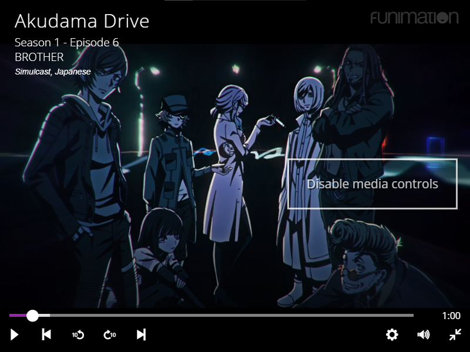
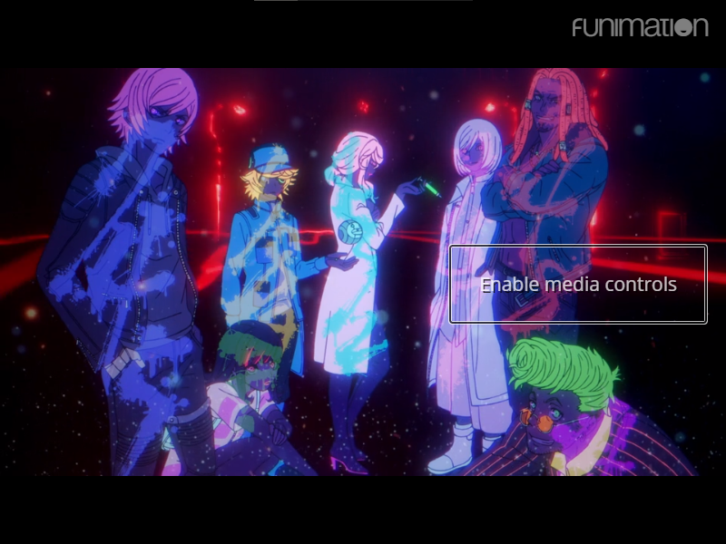

# Funimation Media Control Toggle

A Chrome extension that adds a toggle to disable the video player controls on [funimation.com](funimation.com).

Funimation has a known bug in the embedded Brightcove media player where the UI for media controls do not disappear in fullscreen without some of the following workarounds:
* Moving the cursor to another display
* Randomly tapping the screen on a touch-screen device
* Randomly clicking or moving the cursors
* Inspecting the page in dev tools and manually hiding the overlay elements or disabling pointer events
* Not touching the cursor after touching

This extension offers an easier solution: a button to toggle the visibility of the media controls so you can watch your anime in peace!

Hopefully Funimation fixes the fullscreen bug and I can depcreate this. Since this has been a known bug since 2017, that doesn't seem like it'll happen any time soon...

## Usage

1. Open any video on funimation.com in fullscreen.
1. Hover your cursor on the right side of the video to show the toggle
1. Click **Disable media controls** to hide the progress bar and video title. This prevents mouse movements from showing these elements.
1. Click **Enable media controls** to re-enable the progress bar and title.

## Screenshots

*Note: The button only appears when the cursor is over it.*




## Installation

### Clone this repository

#### Option 1: git

Run the following in your terminal:
```
git clone https://github.com/wong-a/funimation-media-control-toggle.git
```

Or via SSH:
```
git clone git@github.com:wong-a/funimation-media-control-toggle.git
```

#### Option 2: Download the ZIP

1. Click [Download ZIP](https://github.com/wong-a/funimation-media-control-toggle/archive/main.zip).
1. Extract the .zip file

### Install the unpacked extension in Chrome

1. Open [chrome://extensions](chrome://extensions).
1. Click **Load unpacked**
1. Select the directory you cloned this repository to